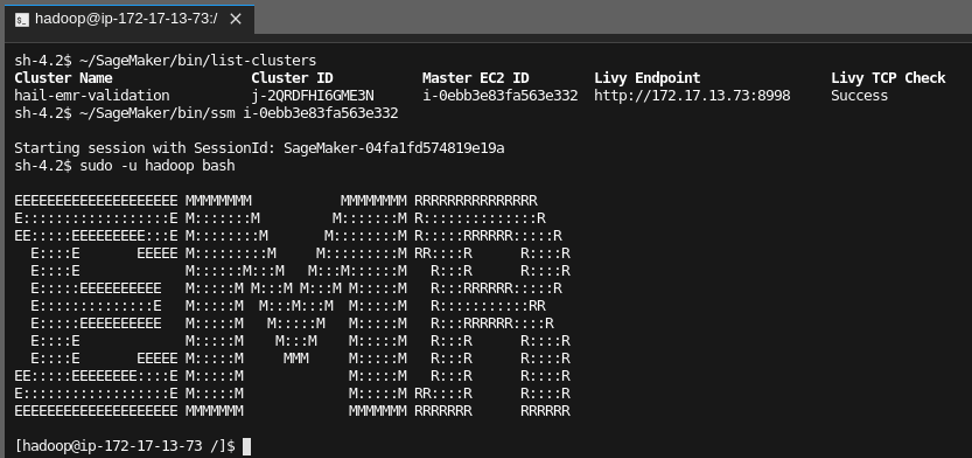

// Add steps as necessary for accessing the software, post-configuration, and testing. Don’t include full usage instructions for your software, but add links to your product documentation for that information.
//Should any sections not be applicable, remove them

//== Test the deployment
// If steps are required to test the deployment, add them here. If not, remove the heading

== Post deployment steps
// If Post-deployment steps are required, add them here. If not, remove the heading
include::test_deployment.adoc[]

== Best practices for using {partner-product-name} on AWS
// Provide post-deployment best practices for using the technology on AWS, including considerations such as migrating data, backups, ensuring high performance, high availability, etc. Link to software documentation for detailed information.

Although you can work with Hail on EMR through the notebook, you might simply want to access and explore the hosts. If you need to access the hosts, make sure you set *Allow SSM Shell Access to EMR Nodes* to true when you launch the cluster through the Service Catalog. 

You can then start SSH sessions on those nodes by using the Start Session feature in AWS Systems Manager Session Manager console. You can also start a session from your local machine using the AWS Command Line Interface (AWS CLI) or a notebook’s JupyterLab console, as demonstrated below:

// == Security
// Provide post-deployment best practices for using the technology on AWS, including considerations such as migrating data, backups, ensuring high performance, high availability, etc. Link to software documentation for detailed information.

// _Add any security-related information._

// == Other useful information
//Provide any other information of interest to users, especially focusing on areas where AWS or cloud usage differs from on-premises usage.

//_Add any other details that will help the customer use the software on AWS._