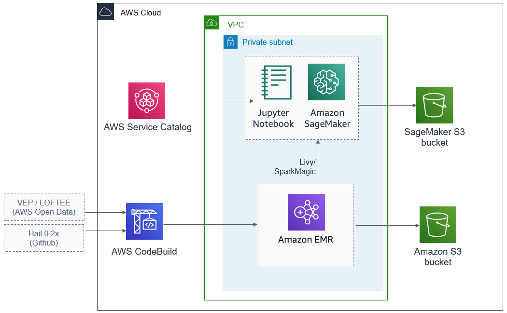
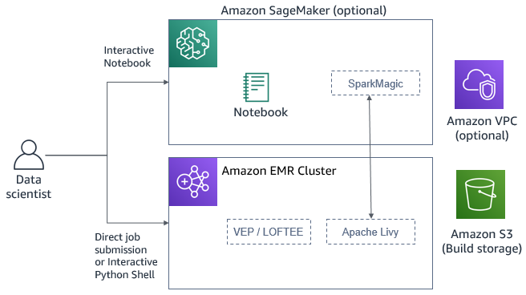

Deploying this Quick Start for a new virtual private cloud (VPC) with
default parameters builds the following {partner-product-name} environment in the
AWS Cloud.

[#architecture1]
.Quick Start architecture for {partner-product-name} on AWS

After the Hail Service Catalog portfolio is deployed, you can spin up Notebook instances and {partner-product-name} clusters that can talk to each other through SparkMagic and Livy.

As shown in figure 1, the Quick Start sets up the following:

* A Hail 0.2 AWS Service Catalog portfolio, allowing you to create and manage your own {partner-product-name} clusters.
* Four AWS CodeBuild pipelines to support building various combinations of Hail 0.2.x releases, Variant Effect Predictor (VEP) versions, and Loss-Of-Function Transcript Effect Estimator (LOFTEE) plug-ins.
* A Hail SageMaker Notebook Instance Service Catalog product that lets you stand up and tear down JupyterLab Notebook environments that integrate with Hail clusters (through SparkMagic and Livy).
* A Hail EMR Cluster Service Catalog product that lets you stand up and tear down {partner-product-name} clusters on Amazon EMR as needed.
* A SageMaker S3 bucket to back up launched Notebook environments. 
* An Amazon S3 bucket for staging artifacts that are related to Hail.
* An optional VPC configured with private subnet, according to AWS best practices, to provide you with your own virtual network on AWS.