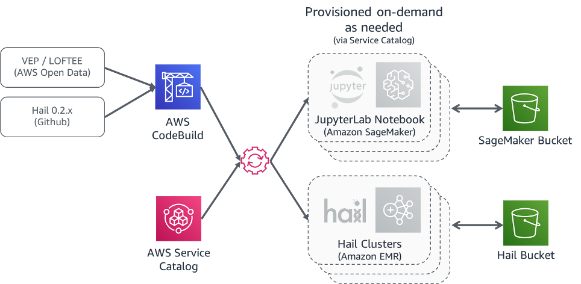

Deploying this Quick Start for a new virtual private cloud (VPC) with
*default parameters* builds the following _{partner-product-name}_ environment in the
AWS Cloud.

[#architecture1]
.Quick Start architecture for _{partner-product-name}_ on AWS

Once the Hail Service Catalog portfolio is deployed, you can begin spinning up Notebook Instances and Hail Clusters that can talk to each other via SparkMagic/Livy.

image::../images/overview.png[Overview,width=648,height=439]

As shown in Figure 1, the Quick Start sets up the following:

* 4 AWS CodeBuild pipelines to support building various combinations of Hail 0.2.x releases, VEP versions, and LOFTEE.
* A Hail 0.2 AWS Service Catalog portfolio.
* A “Hail EMR Cluster” Service Catalog product which lets you stand up and tear down Hail 0.2 clusters on AWS EMR as needed.
* A “Hail SageMaker Notebook Instance” Service Catalog product that lets you stand up and tear down JupyterLab notebook environments that integrate with Hail clusters (via SparkMagic\Livy).
* An Amazon S3 bucket staging various artifacts related to Hail
* An S3 bucket used to back up Notebook environments launched. 
* An optional VPC configured with public and private subnets, according to AWS best practices, to provide you with your own virtual network on AWS.