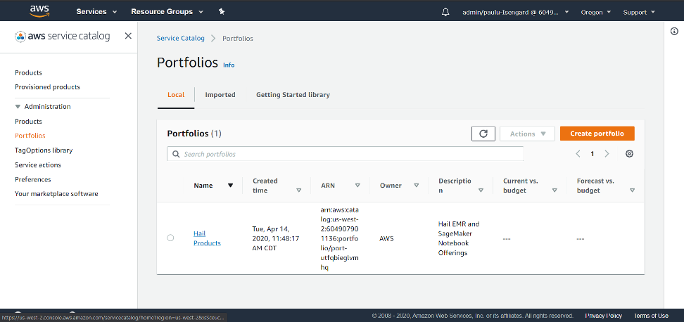
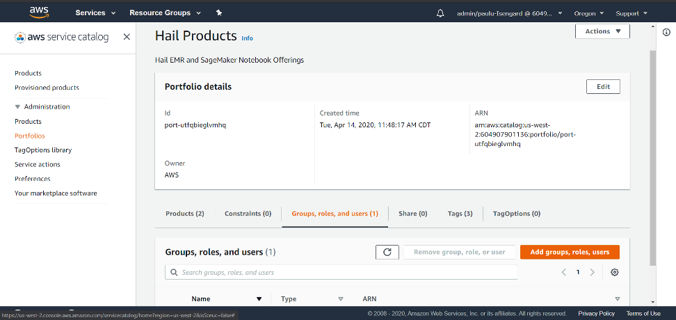
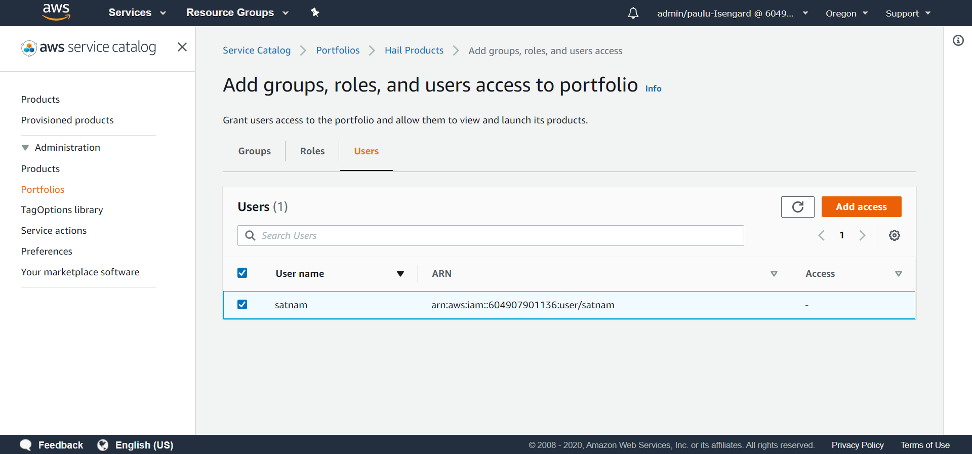
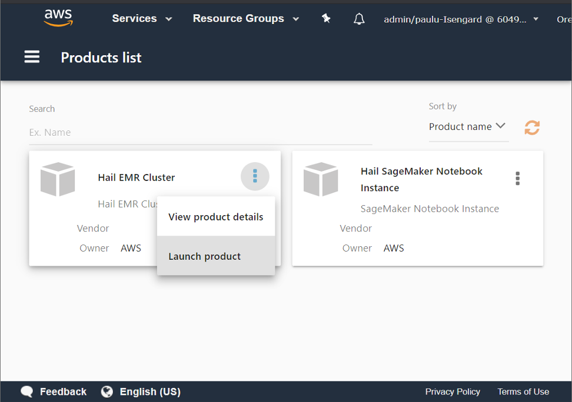
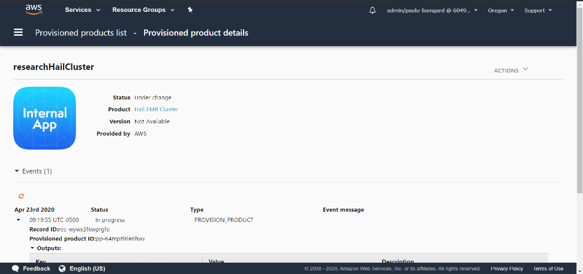
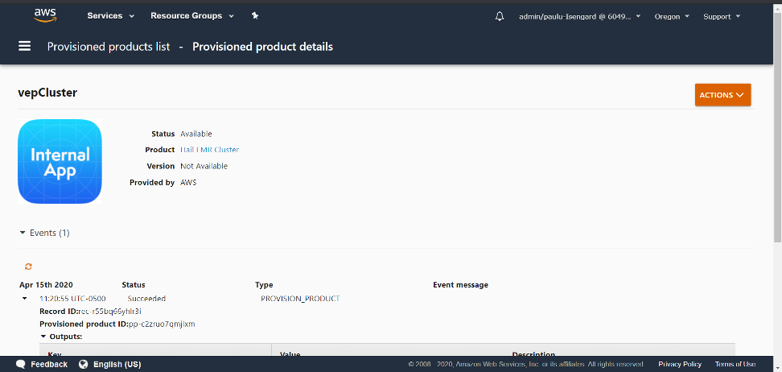
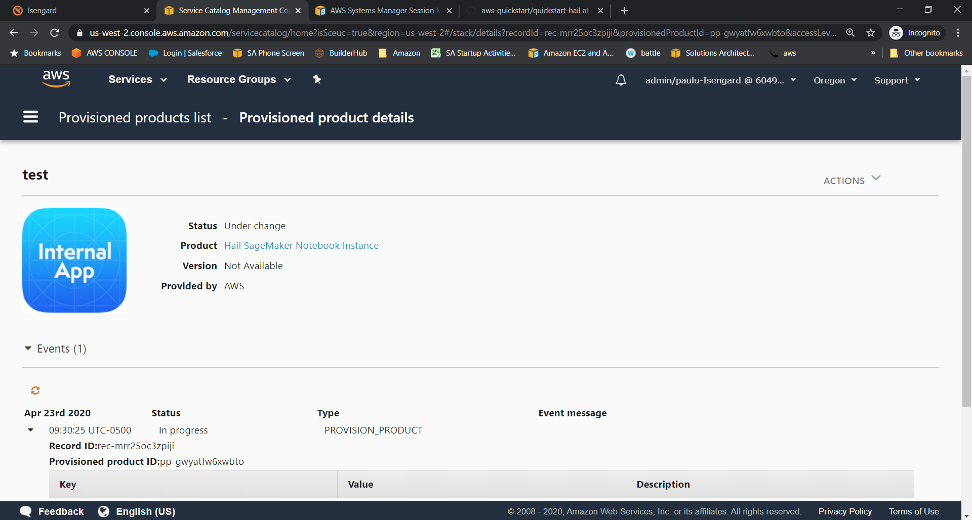
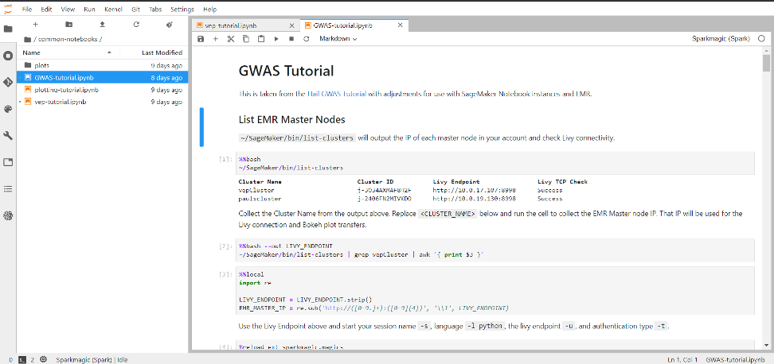

// Add steps as necessary for accessing the software, post-configuration, and testing. Don’t include full usage instructions for your software, but add links to your product documentation for that information.
=== Grant permissions to the Hail 0.2 Service Catalog Portfolio

Open the AWS Service Catalog console and choose the *Hail Products* portfolio.

Choose the *Groups, roles, and users (1)* tab, and then choose the *Add groups, roles, users* button.

Choose the IAM users/roles/groups that you want to grant the ability to launch {partner-product-name} clusters or Notebooks. For example, if you are giving access to an IAM user, even though you launched the catalog, you still must explicitly grant yourself permissions this way. Don’t forget to grant yourself access. 

=== Launch a Hail Cluster

Return to the Service Catalog and choose the *Products* link at the top on the left gutter. Non-administrators who visit the Service Catalog in the console are taken directly to this location.

Select the stacked dots on the {partner-product-name} EMR Cluster product and choose *Launch Product*. 

Provide a name for the {partner-product-name} cluster and choose *Next* to see the following {partner-product-name} cluster options.

.Cluster Primary Settings
[width="100%",cols="16%,11%,73%",options="header",]
|===
|Parameter label |Default |Description

// Space needed to maintain table headers
|Cluster Name |**__Requires input__** |Name of the EMR cluster
|Hail AMI |'' |(Optional) Custom AMI, specific version from the public AMI list, or empty value.  If empty, the latest public Hail with VEP AMI is used.
|EMR Release |emr-5.29.0 |AWS EMR release version to use for cluster nodes.
|Root Volume Size |100 |Root volume size in GB for all cluster instances.
|EBS KMS Key ARN |'' |(Optional) The full KMS Key ARN if region level EBS encryption is enabled. Note, this does NOT automatically encrypt your AMI.
|Instance Termination Protection |false |Choose *True* to enable instance termination protection on Master and Core nodes of the cluster.
|Allow SSM Shell Access from SageMaker Notebook Instances |false |Choose *True* to allow SSM Shell access to cluster nodes from SageMaker Notebook instances. To fully enable the setting, select *True* when creating SageMaker notebook instances.
|===

.Master Instance Settings
[width="100%",cols="16%,11%,73%",options="header",]
|===
|Parameter label |Default |Description

// Space needed to maintain table headers
|Master Node Size |m5.xlarge |Instance type to use for EMR master node
|===

.Core Instance Settings
[width="100%",cols="16%,11%,73%",options="header",]
|===
|Parameter label |Default |Description

// Space needed to maintain table headers
|Number of Core Nodes |1 |Number of core nodes to launch with the cluster. Must be >= 1.
|Core Instance Size |r5.xlarge |Instanct type to use for EMR core nodes
|Scratch Volume Size |100 |Secondary GP2 data volume size in GB for CORE nodes. Available on /mnt
|===

.Auto Scaling Task Node Settings
[width="100%",cols="16%,11%,73%",options="header",]
|===
|Parameter label |Default |Description

// Space needed to maintain table headers
|Market |ON_DEMAND |Select “SPOT” to use Spot instances for Task nodes. Spot instances are used with a max bid of the on demand price.
|Minimum number of Task Nodes |1 |Value of 0 disables task nodes and auto scaling.
|Maximum number of Task Nodes |1 |Must be equal to or greater than minimum.
|Task Node Size |r5.large |Instance type to use for EMR task nodes
|===

.Tagging
[width="100%",cols="16%,11%,73%",options="header",]
|===
|Parameter label |Default |Description

// Space needed to maintain table headers
|Environment Tag |development |Environment type for default resource tagging.
|Owner Tag |'' |(Optional) - Owner of the resources. Person/Department, etc.
|===

Proceed through the Service Catalog wizard accepting default values for the *Tag Options*, *Notifications*, and *Review* phases of the wizard, and then choose *Launch*.

It will look like this while your cluster is being provisioned:

The status will change to succeeded when it is complete. 

=== Launch a Hail Notebook

Go back to Service Catalog’s product list page, choose the *Hail SageMaker Notebook Instance* and choose *Launch product*. Provide a name for your Service Catalog product launch in the *Product version* phase of the launch wizard. Supply the following parameters when you reach the *Parameters* phase.

.Instance Details
[width="100%",cols="16%,11%,73%",options="header",]
|===
|Parameter label |Default |Description

// Space needed to maintain table headers
|Instance Name |**__Requires input__** |Used as the name of the notebook instance and S3 backup location. User name is recommended - E.g. jsmith
|Instance Type |ml.t3.medium |Instance type to use for the notebook instance
|Volume Size |20 |Size in GB of the EBS volume used by the notebook instance
|Allow SSM Shell Access to EMR Nodes |false |Choose *True* to allow SSM Shell access to cluster nodes from SageMaker notebook instances. To be fully enabled, set this setting to *True* when creating an EMR cluster.
|===

.Tagging
[width="100%",cols="16%,11%,73%",options="header",]
|===
|Parameter label |Default |Description

// Space needed to maintain table headers
|Environment Tag |development |Environment type for default resource tagging.
|Owner Tag |'' |(Optional) - Owner of the resources. Person/Department, etc.
|===

Proceed through the *Tag Options*, *Notificatons*, and *Review* phases of the wizard. Accept the default settings and choose *Launch*.

It should look like the following once the Notebook is completed. 

=== Open the notebook, connect to the cluster, and conquer

Go to SageMaker in the web console, and choose *Notebook instances* in the left gutter. You will see a notebook instance with the *name* tag you specified when you launched the notebook from the Service Catalog. Select that Notebook instance and select the *Open JupyterLab* hyperlink. 

image::../images/testing/open_notebook.png[Open notebook,width=648,height=439]

Once the Notebook launches, navigate to the *common-notebooks* folder to see example Notebooks that show how to connect to the EMR cluster and begin your {partner-product-name} session. 

