# Hail on EMR

This solution was designed to provide a reproducible, easy to deploy environment to integrate [Hail](https://hail.is) with [AWS EMR](https://aws.amazon.com/emr/faqs/?nc=sn&loc=7).  Where possible, AWS native tools have been used.

To integrate Hail and EMR, we leverage [Packer](https://www.packer.io/) from HashiCorp alongside [AWS CodeBuild](https://aws.amazon.com/codebuild/faqs/?nc=sn&loc=5) to create a custom AMI pre-packaged with Hail, and optionally containing the [Variant Effect Predictor (VEP)](https://uswest.ensembl.org/info/docs/tools/vep/index.html). Then, an EMR cluster is launched using this custom AMI.

Users leverage an AWS SageMaker Notebook instance to run JupyterLab, and pass commands to Hail from the Notebook via [Apache Livy](https://livy.incubator.apache.org/).

This repository contains an AWS Quick Start solution for rapid deployment into your AWS account. Certain parts of this repository assume a working knowledge of AWS, CloudFormation, S3, EMR, Hail, Jupyter, SageMaker, EC2, Packer, and shell scripting.

The core directories in this repository are:

- packer-files - Documentation and example configuration of Packer (used in the AMI build process)
- sagemaker - Sample Jupyter Notebooks and shell scripts
- submodules - Optional submodules supporting the deployment
- templates - CloudFormation nested stacks
- vep-configuration - VEP JSON configuration files

This document will walk through deployment steps, and highlight potential pitfalls.

## Table of Contents

- [Hail on EMR](#hail-on-emr)
  - [Table of Contents](#table-of-contents)
  - [Deployment Guide](#deployment-guide)
  - [EMR Overview](#emr-overview)
    - [Autoscaling Task Nodes](#autoscaling-task-nodes)
  - [SageMaker Notebook Overview](#sagemaker-notebook-overview)
    - [SSM Access](#ssm-access)
  - [Building AMIs](#building-amis)
    - [Hail with VEP](#hail-with-vep)
    - [Hail Only](#hail-only)

## Deployment Guide

_Note:  This process will create S3 buckets, IAM resources, AMI build resources, a SageMaker notebook, and an EMR cluster.  These resources may not be covered by the AWS Free Tier, and may generate significant cost.  For up to date information, refer to the [AWS Pricing page](https://aws.amazon.com/pricing/)._

_You will require elevated IAM privileges in AWS, ideally AdministratorAccess, to complete this process._

To deploy Hail on EMR, follow these steps:
1. Log into your AWS account and navigate to the [S3 console](https://console.aws.amazon.com/s3/).

2. Create an S3 bucket in the region you would like to launch this CloudFormation stack in.  In your newly created S3 Bucket, create a directory called "quickstart-hail".
   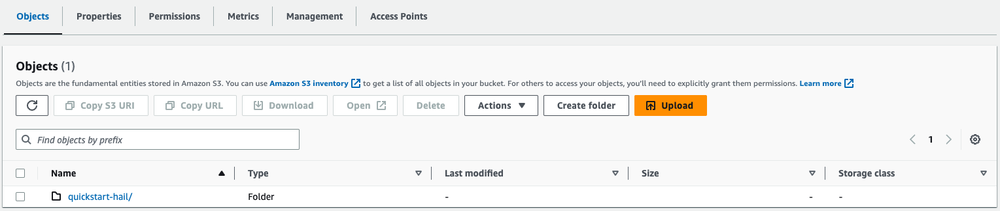

3. Download the contents of this repository, unzip, and place the downloaded contents into the "quickstart-hail" directory in your S3 bucket. Your final result should look the following:
  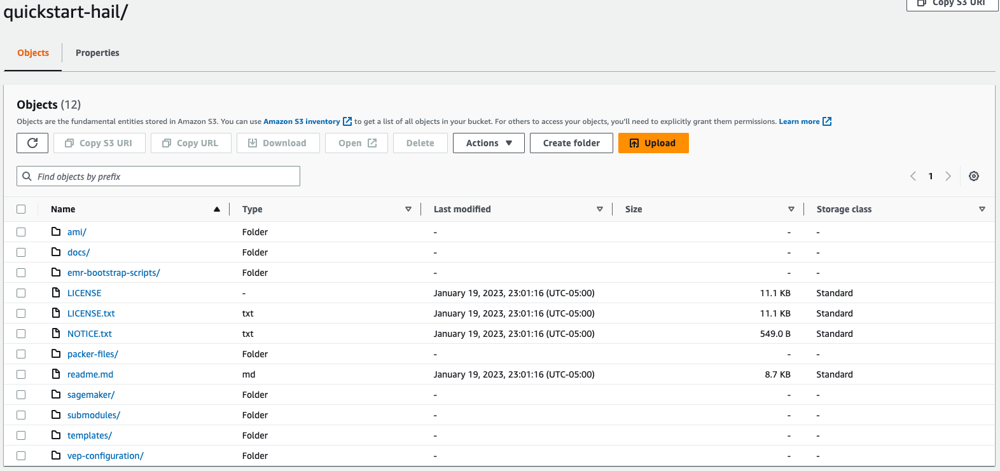

4. Navigate to the "templates" directory of your S3 bucket.  Find the file named "hail-master.template.yaml" and copy the S3 object URL.  Save this URL as we will use it to launch our solution.
   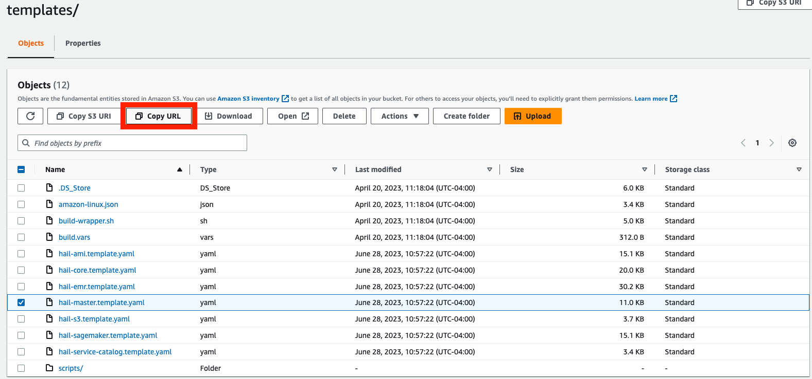
  
5. Navigate to the [CloudFormation console]([https://console.aws.amazon.com/s3/](https://console.aws.amazon.com/cloudformation).

6. Create a new stack using the S3 URL that you copied in step 4 as a template source.
   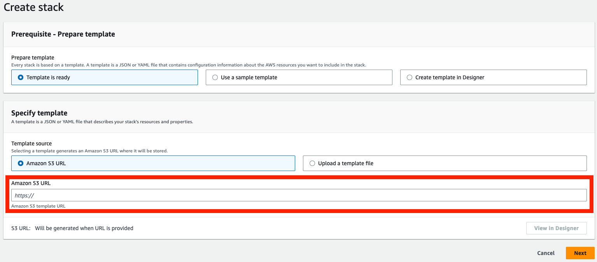

7. Set parameters based on your environment requirements. This CloudFormation template includes an **optional** *Identity and Access Management* section where you can set a permission boundary as well custom prefixes/suffixes to be used with all IAM role and policy names created by the templates.  Check with your IT administrator if this is required in your AWS environment.  Once all parameters are set, choose *Next*.

8. Optionally configure stack options and choose *Next*.

9. Review your settings and acknowledge the stack capabilities. Choose *Create Stack*.

    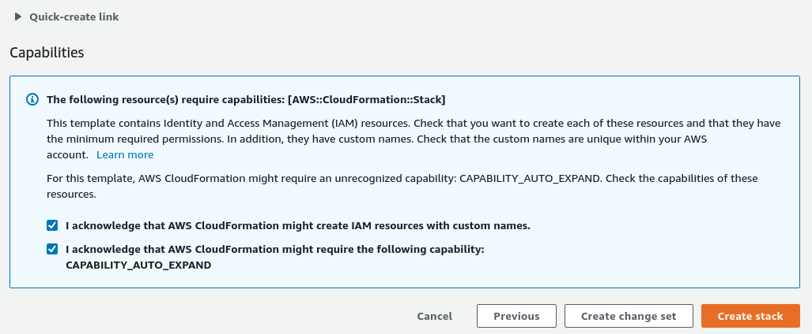

10. Once stack creation is complete, select the root stack and open the *Outputs* tab.  Locate and choose the Service Catalog Portfolio URL.

    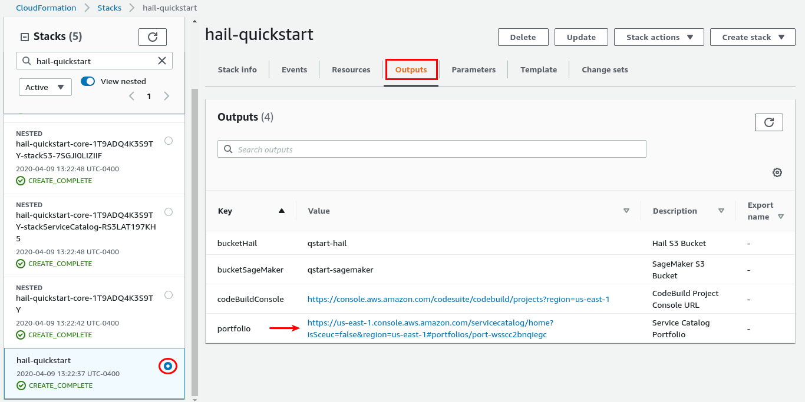

11. The Service Catalog Portfolio requires assignment to specific Users, Groups, or Roles.  Select the `Users, Groups, or Roles` tab and click `Add groups, roles, users`.

    

12. Select the users, groups, and/or roles that will be allowed to deploy the Hail EMR cluster and SageMaker notebook instances.  When complete, click `Add Access`.

    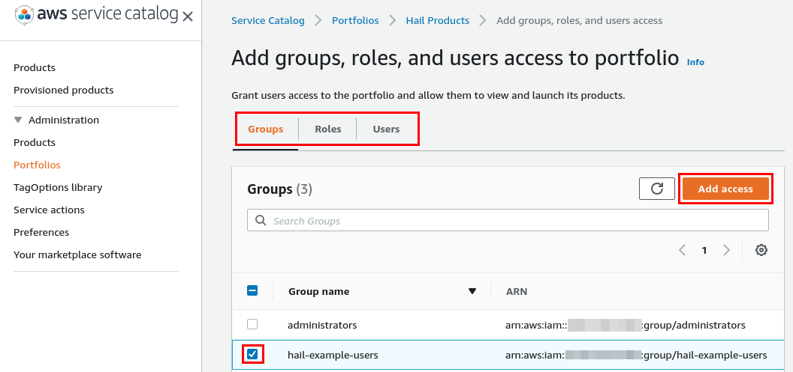

13. The selected users, groups, or roles can now click `Products` in the Service Catalog console.

    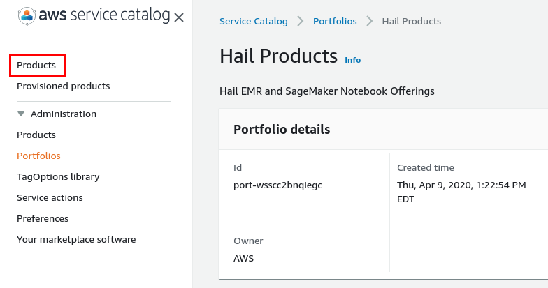

14. Launch a Hail EMR Cluster using your custom Hail AMI built from the [Building AMIs](#building-amis) section to get started. **Note: Building custom AMI is required before launching EMR cluster.**

    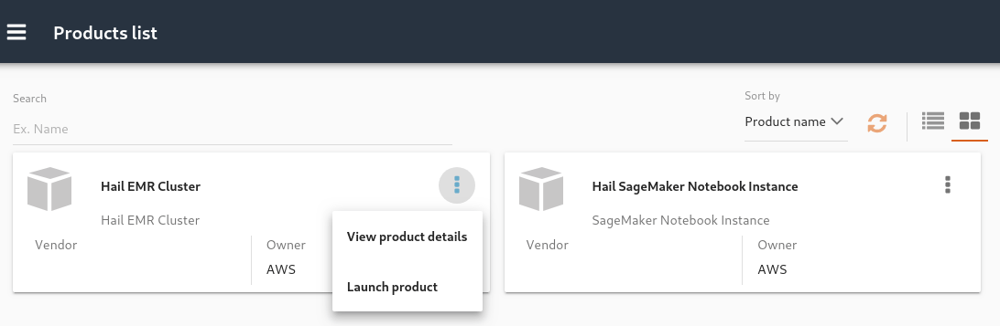

15. Launch a Hail SageMaker Notebook Instance.  Once the SageMaker Notebook Instance is provisioned open the Console Notebook URL.  This will bring you to the SageMaker console for your specific notebook instance.

    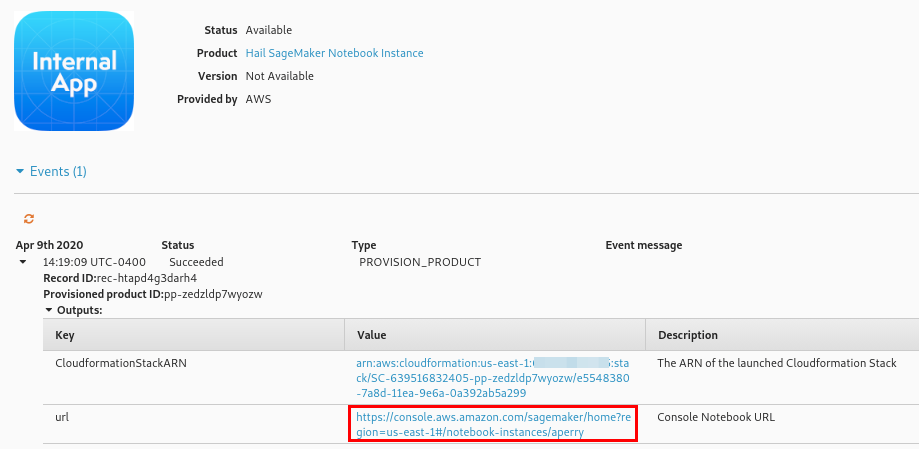

16. Select `Open JupyterLab`.

    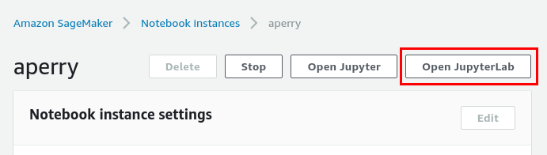

17. Inside your notebook server, note that there is a `common-notebooks` directory.  This directory contains tutorial notebooks to get started interacting with your Hail EMR cluster.

    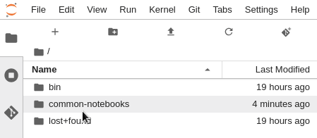

## EMR Overview

The Service Catalog product for the Hail EMR cluster will deploy a single master node, a minimum of 1 core node, and optional autoscaling task nodes.

The [AWS Systems Manager Agent](https://docs.aws.amazon.com/systems-manager/latest/userguide/ssm-agent.html) (SSM) can be used to gain ingress to the EMR nodes. This agent is pre-installed on the AMI. To allow SageMaker Notebook instance to connect to the Hail cluster nodes, set the following parameter to *true*.

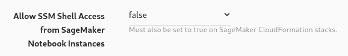

Notebook service catalog deployments also require a parameter adjustment to complete access.

### Autoscaling Task Nodes

Task nodes can be set to 0 to omit them.  The target market, *SPOT* or *ON_DEMAND*, is also set through parameters.  If *SPOT* is selected, the bid price is set to the current on-demand price of the selected instance type.

EMR uses [managed scaling](https://docs.aws.amazon.com/systems-manager/latest/userguide/ssm-agent.html) which lets you automatically increase or decrease the number of instances or units in your cluster based on workload. EMR managed scaling continuously evaluates cluster metrics to make scaling decisions that optimize your clusters for cost and speed. 

## SageMaker Notebook Overview

The Service Catalog product for the SageMaker Notebook instance deploys a single Notebook instance in the same subnet as your EMR cluster.  Upon launch, several example Notebooks are seeded into the *common-notebooks* folder.  These example notebooks offer an immediate orientation interacting with your Hail EMR cluster.

### SSM Access

CloudFormation parameters exist on both the EMR Cluster and SageMaker Notebook products to optionally allow Notebook instances shell access through SSM.  Set the following parameter to *true* on when deploying your notebook product to allow SSM access.

Example connection from Jupyter Lab shell:

## Building AMIs

Hail on EMR requires the use of a custom AMI with Hail, Spark, VEP, and reference genomes preconfigured.  This build process is driven by Packer, and leverages AWS CodeBuild.  Note that some of these software packages are optional, and the build process can be executed for different versions or combinations of these software packages.

### Execute a GUI Build in CodeBuild

Before building, keep the following in mind:

- Builds including VEP can take a _very_ long time (upwards of 1-2 hours in some cases)
- AMI names are unique.  If building an updated AMI, deregister the previous

From the AWS CodeBuild dashboard, select the desired build's radio button and click **Start with overrides**.

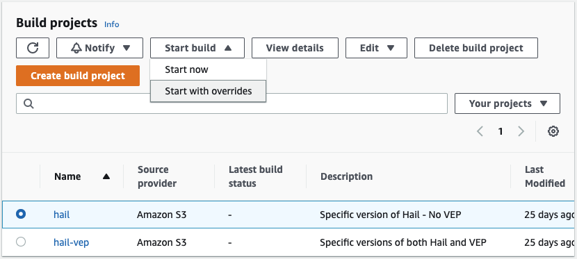

On the next page you may optionally override any build parameters but are required to override the `HAIL_VERSION` value to whatever hail version you wish to use then click **Start build**.

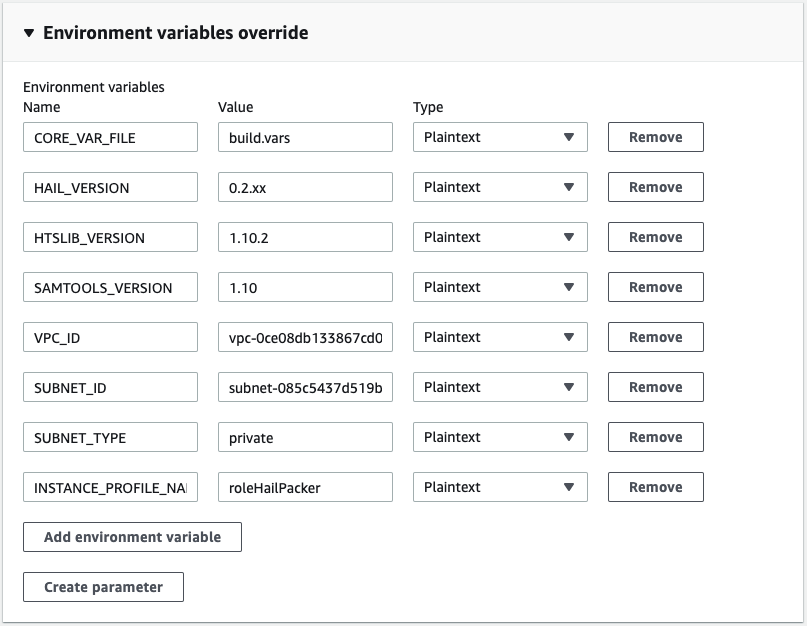

Once the build begins you can optionally tail logs to the view progress.  Closing this window will not terminate the build.

### Troubleshooting

#### AMI Exists

AMI names are unique.  In order to rebuild an AMI with the same name you will need to deregister the AMI your AWS account and target region.

#### Additional Documentation

Additional documentation on the building a custom Hail AMI can be found in the [AMI Creation Guide](docs/ami-creation.md)
